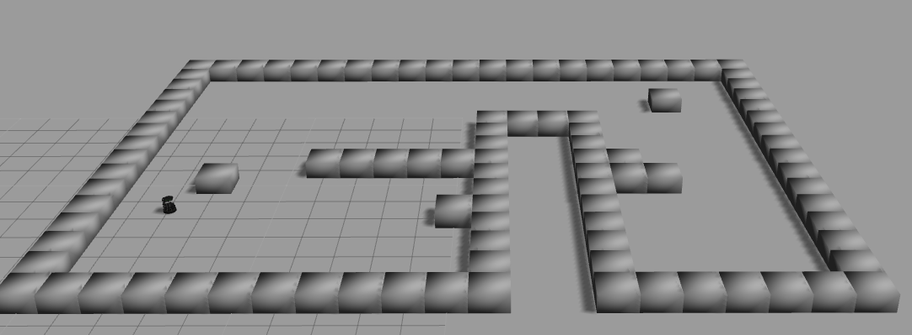
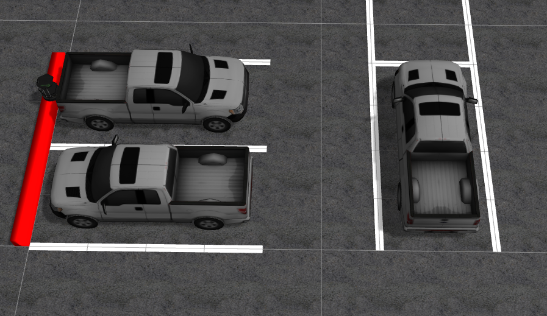

# Creating Custom Worlds/Mazes for Gazebo

There are 3 sections in this document.  
- The first section describes how to create and setup the `world_maker` catkin package.
- The second section describes how to create a world/maze with numerous unit cubes and a single turtlebot.
- The last section describes how to build a parking lot world.

--- 

** NOTE:  The launch files referenced below will not work right now.**
- We need to make some updates for ROS Noetic.

---

## 1) Setup the `world_maker` Package.

1. Grab the current github repo
    ```
    cd ~/Downloads
    rm -rf spring2023
    git clone https://github.com/IE-482-582/spring2023.git
    ```	

2. Run the installation script
    ```
    cd ~/Downloads/spring2023/world_maker
    chmod +x install_world_maker.sh
    ./install_world_maker.sh
    ```
	This will create a new package named `world_maker` in your `~/catkin_ws/src/` directory.

---

## 2) Creating a Custom Maze World

These instructions will explain how to generate a maze composed of numerous unit cubes (1x1x1 meter blocks).  



**NOTE:** The files mentioned below are contained in `~/catkin_ws/src/world_maker/scripts`.

1. Make a backup copy of these files, just in case something goes wrong:
    ```
    cd ~/catkin_ws/src/world_maker/scripts
    cp custom_world_coords.xls custom_world_coords_BACKUP.xls
    cp custom_world_coords.csv custom_world_coords_BACKUP.csv
    cp custom_world.world custom_world_BACKUP.world
    ```
    
2. Edit the `custom_world_coords.xls` file in Libre Office Calc.

3. Save as `custom_world_coords.csv` (export as `.csv` file):
    - File --> Save As...
    - Choose file type = "Text CSC (.csv)"
    - Name the file `custom_world_coords.csv`
    - Save
	
3. Run the python script to generate a `.world` file:
	```
	cd ~/catkin_ws/src/world_maker/scripts
	python3 create_world.py
	```	
    This will create a file named `custom_world.world`.
	
4. Test out your new world:
	```
	cd ~/catkin_ws/src/world_maker/scripts
	roslaunch world_maker custom_world.launch
	```

5. Want to start your turtlebot in a different location?
	- Open `kobukiTEST.launch.xml`
	- Edit the line that looks like this:
		```
		args="$(optenv ROBOT_INITIAL_POSE) -unpause -urdf -param robot_description -model mobile_base -x 1.5 -z 10"/>
		```
		You can add a `-y 0.0` parameter to set the y coordinate.
		
---		

## 3) Creating a Parking Lot World

There is another set of instructions to create a simulated parking lot.



1. Make a backup copy of these files, just in case something goes wrong:
    ```
    cd ~/catkin_ws/src/world_maker/scripts
    cp sample_parking_lot.xls sample_parking_lot_BACKUP.xls
    cp sample_parking_lot.csv sample_parking_lot_BACKUP.csv
    cp parking_lot.world parking_lot_BACKUP.world
    ```

2. Edit the `sample_parking_lot.xls` file in Libre Office Calc.
    NOTES:
    - This spreadsheet has 4 columns that you need to fill in.
        - `x` and `y` are the coordinates of the **midpoint** of the object.
        - `type` may only be the following: 
            - `lane` -- a white line in the parking lot.
            - `car` -- a vehicle to occupy a parking space.
            - `curb` -- a raised object.
        - `length` describes the longest dimension of the object.  For `car`, `length` should equal 0 (it's ignored).
        - `angle` is the rotation of the object.  A horizontal `lane` or `curb` will be at 0 degrees.  However, the pickup model appears to be rotatated, so a horizontal pickup should be at 90 degrees.
    - The graph in the Excel spreadsheet isn't terribly helpful, as it doesn't show the line lengths.
	
3. Save as `sample_parking_lot.csv` (export as `.csv` file):
    - File --> Save As...
    - Choose file type = "Text CSC (.csv)"
    - Name the file `sample_parking_lot.csv`
    - Save
	
3. Run the python script to generate a `.world` file:
    ```
    cd ~/catkin_ws/src/world_maker/scripts
    python3 create_parking_world.py
    ```	
    This will create a file named `parking_lot.world`.

4. Test out your new world:
    ```
    cd ~/catkin_ws/src/world_maker/scripts
    roslaunch world_maker parking_lot.launch
    ```

    NOTE: 
    - The first time you run the launcher, ROS will need to download the models for the asphalt background and the pickup.  Be patient.
	
8. If you use the pickup model, you might notice that it's rather big.  Here's how you can reduce the scale:
    ```
    cd ~/.gazebo/models/pickup/meshes
    pico pickup.dae
    ```
    
    Scroll down to about line 11, where you'll see `<unit name="inch" meter="0.0254"/>`.  I found that making one inch equal 0.0154 meters does a pretty good job.

9. You can customize some properties of the lanes and curbs.
    ```
    cd ~/catkin_ws/src/world_maker/scripts
    pico create_parking_world.py
    ```
	
    Near the top of this Python script you'll see several editable parameter values.  For example:
    - `asphaltHeight`
    - `lineColor`
    - `curbHeight`
    - `curbColor`
